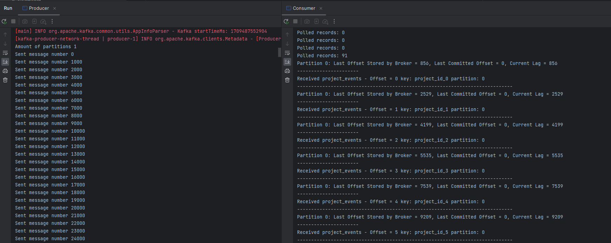
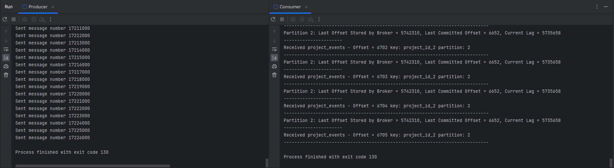

# Test 4: The risk of data loss due to consumer lag

## Introduction
**What is Kafka consumer lag?**

Kafka consumer lag is the difference between the last offset stored by the broker and the last committed offset for that partition.

**Common reasons for Kafka consumer lag:**
1. Incoming traffic surges
2. Data skew in partitions
3. Slow processing jobs (slow consumers)
4. Errors in code and pipeline components

In this test we've conducted several comparisons to see what influences the consumer lag and how big this lag can be.

## Setup
In `resources/consumer.properties` we set some new properties:
```
bootstrap.servers=localhost:9092
key.deserializer=org.apache.kafka.common.serialization.StringDeserializer
value.deserializer=org.apache.kafka.common.serialization.StringDeserializer
group.id=test-consumer-lag
enable.auto.commit=true
auto.commit.interval.ms=1000
```
* `enable.auto.commit` parameter controls whether the consumer will commit offsets automatically. (We know that it defaults to true, but wanted to explicitly show it).
* `auto.commit.interval.ms` parameter specifies how frequently offsets will be committed, default is 5 seconds.

To test and analyse ***consumer lag*** we have extended the `Consumer.java` class to display the current consumer lag while consuming messages.
```java
try {
    while (true) {
        ConsumerRecords<String, String> records = kafkaConsumer.poll(Duration.ofMillis(100));
        System.out.println("Polled records: " + records.count());

        for (ConsumerRecord<String, String> record : records) {
            switch (record.topic()) {
                case "project_events":
                    for (TopicPartition par : records.partitions())
                    {
                        // Get the end offset for the partition
                        long endOffset = kafkaConsumer.endOffsets(Collections.singletonList(par)).get(par);

                        /// Get the committed offset
                        Map<TopicPartition, OffsetAndMetadata> committedOffsets = kafkaConsumer.committed(Collections.singleton(par));
                        OffsetAndMetadata committedMetadata = committedOffsets.get(par);

                        // Check if the committed offset is available
                        long committedOffset = -1;
                        if (committedMetadata != null) {
                            committedOffset = committedMetadata.offset();
                            System.out.println("Offset: " + committedOffset + " committed by the consumer group to partition " + par.partition());
                        }
                        
                        // Calculate the consumer lag
                        long consumerLag = endOffset - committedOffset;
                        System.out.println("Partition " + par.partition() +
                                ": Last Offset Stored by Broker = " + endOffset +
                                ", Last Committed Offset = " + committedOffset +
                                ", Current Lag = " + consumerLag);
                    }
                    
                    System.out.println("----------------------");
                    System.out.println("Received project_events - Offset = " + record.offset() +  " key: " + record.key() + " partition: " + record.partition());
                    System.out.println("-----------------------------------------------------------------------------");
                    break;
                default:
                    throw new IllegalStateException("Shouldn't be possible to get message on topic " + record.topic());
            }
        }

        System.out.println("################# Polled records processed ##################");
    }
}
```

In this test, we want to check several options on how they affect the lag and its size:
1. The rate at which the producer sends messages (verified by `Thread.sleep()`)
2. The reduction of the commit interval with `Thread.sleep()` added to Producer
2. The number of partitions
3. Slowing down the consumer by reducing the amount of record processing by `poll()` or using `Thread.sleep()` to simulate long consumer processing

### 1. Frequency of Producer sending messages:
Without `Thread.sleep()`
```java
try {
    for (long i = 0; i < 1000000000000L; i++) {
        kafkaProducer.send(new ProducerRecord<>(
                "project_events", // topic
                "project_id_" + i, //key
                "some_value_" + System.nanoTime()) //value
        );

        if (i % 1000 == 0) {
            System.out.println("Sent message number " + i);
        }
    }
}
```

With `Thread.sleep()`
```java
try {
    for (long i = 0; i < 1000000000000L; i++) {

        Thread.sleep(10);
        
        kafkaProducer.send(new ProducerRecord<>(
                "project_events", // topic
                "project_id_" + i, //key
                "some_value_" + System.nanoTime()) //value
        );

        if (i % 10 == 0) {
            System.out.println("Sent message number " + i);
        }
    }
}
```

### 2. auto.commit.interval.ms
Let's combine now auto commit interval with a bit better behaviour of Consumer after adding `Thread.sleep()` to Producer.
In `resources/consumer.properties` modify the `auto.commit.interval.ms` property:
```
auto.commit.interval.ms=10
```

### 3. More partitions:
Modify `Producer.java` to specify 3 keys:
```java
try {
    for (long i = 0; i < 1000000000000L; i++) {
        kafkaProducer.send(new ProducerRecord<>(
                "project_events", // topic
                (int) (i % 3), // partition
                "project_id_" + (i % 3), //key
                "some_value_" + System.nanoTime()) //value
        );

        if (i % 1000 == 0) {
            System.out.println("Sent message number " + i);
        }
    }
}
```

### 4. max.pool.records:
In `resources/consumer.properties` add new property `max.poll.records`:
```
max.poll.records=100
```

## Conduct the experiment
### 1. Frequency of Producer sending messages
#### Preparation:
1. Start the Kafka and Zookeeper processes using Docker Compose:
```
docker-compose up --build
```
2. Open an additional terminal window and create `project_events` topic by running:
```
docker-compose exec kafka /opt/bitnami/kafka/bin/kafka-topics.sh --create --bootstrap-server kafka:9092 --replication-factor 1 --partitions 1 --topic project_events
```
3. Start Consumer and Producer applications.

#### Results:
As we can see the consumer lag increases a lot with such a stream of data sent:
(Example output, applications stopped after few seconds just to visualise how quickly the lag increases
)
Without `Thread.sleep()`


`Consumer` terminal output:

```
Partition 0: Last Offset Stored by Broker = 856, Last Committed Offset = 0, Current Lag = 856
----------------------
Received project_events - Offset = 0 key: project_id_0 partition: 0
-----------------------------------------------------------------------------
Partition 0: Last Offset Stored by Broker = 2529, Last Committed Offset = 0, Current Lag = 2529
----------------------
Received project_events - Offset = 1 key: project_id_1 partition: 0
-----------------------------------------------------------------------------
Partition 0: Last Offset Stored by Broker = 4199, Last Committed Offset = 0, Current Lag = 4199
----------------------
Received project_events - Offset = 2 key: project_id_2 partition: 0
-----------------------------------------------------------------------------
.
.
.
Partition 0: Last Offset Stored by Broker = 491108, Last Committed Offset = 91, Current Lag = 491017
----------------------
Received project_events - Offset = 513 key: project_id_513 partition: 0
-----------------------------------------------------------------------------
Partition 0: Last Offset Stored by Broker = 491108, Last Committed Offset = 91, Current Lag = 491017
----------------------
Received project_events - Offset = 514 key: project_id_514 partition: 0
-----------------------------------------------------------------------------
Polled records: 500
Partition 0: Last Offset Stored by Broker = 491108, Last Committed Offset = 515, Current Lag = 490593
----------------------
Received project_events - Offset = 515 key: project_id_515 partition: 0
-----------------------------------------------------------------------------
Partition 0: Last Offset Stored by Broker = 491108, Last Committed Offset = 515, Current Lag = 490593
----------------------
Received project_events - Offset = 516 key: project_id_516 partition: 0
-----------------------------------------------------------------------------
```

With `Thread.sleep(10)`
```
Partition 0: Last Offset Stored by Broker = 4, Last Committed Offset = 0, Current Lag = 4
----------------------
Received project_events - Offset = 0 key: project_id_0 partition: 0
-----------------------------------------------------------------------------
################# Polled records processed ##################
Polled records: 3
Partition 0: Last Offset Stored by Broker = 5, Last Committed Offset = 0, Current Lag = 5
----------------------
Received project_events - Offset = 1 key: project_id_1 partition: 0
-----------------------------------------------------------------------------
.
.
.
Polled records: 1
Partition 0: Last Offset Stored by Broker = 672, Last Committed Offset = 642, Current Lag = 30
----------------------
Received project_events - Offset = 670 key: project_id_670 partition: 0
-----------------------------------------------------------------------------
################# Polled records processed ##################
Polled records: 1
Partition 0: Last Offset Stored by Broker = 673, Last Committed Offset = 642, Current Lag = 31
----------------------
Received project_events - Offset = 671 key: project_id_671 partition: 0
-----------------------------------------------------------------------------
```
In this experiment `Thread.sleep(10)` delays the 'spam' of sent messages from Producer. We can notice that Consumer deals with this pace way better and every second when the commit is made it catches up with the latest broker offset having a current lag of around 1-4. 

### 2. auto.commit.interval.ms
#### Preparation:
1. Start the Kafka and Zookeeper processes using Docker Compose:
```
docker-compose up --build
```
2. Open an additional terminal window and create `project_events` topic by running:
```
docker-compose exec kafka /opt/bitnami/kafka/bin/kafka-topics.sh --create --bootstrap-server kafka:9092 --replication-factor 1 --partitions 1 --topic project_events
```
3. Start Consumer and Producer applications.

#### Results:
```
Partition 0: Last Offset Stored by Broker = 9, Last Committed Offset = 7, Current Lag = 2
----------------------
Received project_events - Offset = 7 key: project_id_7 partition: 0
-----------------------------------------------------------------------------
################# Polled records processed ##################
Polled records: 1
Partition 0: Last Offset Stored by Broker = 10, Last Committed Offset = 8, Current Lag = 2
----------------------
Received project_events - Offset = 8 key: project_id_8 partition: 0
-----------------------------------------------------------------------------
.
.
.
Partition 0: Last Offset Stored by Broker = 339, Last Committed Offset = 337, Current Lag = 2
----------------------
Received project_events - Offset = 337 key: project_id_337 partition: 0
-----------------------------------------------------------------------------
################# Polled records processed ##################
Polled records: 1
Partition 0: Last Offset Stored by Broker = 340, Last Committed Offset = 338, Current Lag = 2
----------------------
Received project_events - Offset = 338 key: project_id_338 partition: 0
-----------------------------------------------------------------------------
```
After modifying `auto.commit.interval.ms` we can notice that the consumer lag did not equal to more than 2.
Which gives us one of the most important conclusion that commit interval can change a lot when it comes to big consumer lag and possible data loss related to it.

### 3. More partitions
#### Preparation:
1. Start the Kafka and Zookeeper processes using Docker Compose:
```
docker-compose up --build
```
2. Open an additional terminal window and create `project_events` topic by running:
```
docker-compose exec kafka /opt/bitnami/kafka/bin/kafka-topics.sh --create --bootstrap-server kafka:9092 --replication-factor 1 --partitions 3 --topic project_events
```
3. Start Consumer and Producer applications.

#### Results:



```
Partition 2: Last Offset Stored by Broker = 815, Last Committed Offset = 0, Current Lag = 815
Partition 1: Last Offset Stored by Broker = 1500, Last Committed Offset = 0, Current Lag = 1500
Partition 0: Last Offset Stored by Broker = 1734, Last Committed Offset = 0, Current Lag = 1734
----------------------
Received project_events - Offset = 0 key: project_id_2 partition: 2
-----------------------------------------------------------------------------
Partition 2: Last Offset Stored by Broker = 2088, Last Committed Offset = 0, Current Lag = 2088
Partition 1: Last Offset Stored by Broker = 3282, Last Committed Offset = 0, Current Lag = 3282
Partition 0: Last Offset Stored by Broker = 4706, Last Committed Offset = 0, Current Lag = 4706
----------------------
Received project_events - Offset = 1 key: project_id_2 partition: 2
-----------------------------------------------------------------------------
Partition 2: Last Offset Stored by Broker = 6130, Last Committed Offset = 0, Current Lag = 6130
Partition 1: Last Offset Stored by Broker = 7554, Last Committed Offset = 0, Current Lag = 7554
Partition 0: Last Offset Stored by Broker = 8266, Last Committed Offset = 0, Current Lag = 8266
----------------------
Received project_events - Offset = 2 key: project_id_2 partition: 2
-----------------------------------------------------------------------------
.
.
.
Partition 2: Last Offset Stored by Broker = 256754, Last Committed Offset = 0, Current Lag = 256754
Partition 1: Last Offset Stored by Broker = 256754, Last Committed Offset = 0, Current Lag = 256754
Partition 0: Last Offset Stored by Broker = 256754, Last Committed Offset = 0, Current Lag = 256754
----------------------
Received project_events - Offset = 64 key: project_id_0 partition: 0
-----------------------------------------------------------------------------
Partition 2: Last Offset Stored by Broker = 256754, Last Committed Offset = 0, Current Lag = 256754
Partition 1: Last Offset Stored by Broker = 256754, Last Committed Offset = 0, Current Lag = 256754
Partition 0: Last Offset Stored by Broker = 256754, Last Committed Offset = 0, Current Lag = 256754
----------------------
Received project_events - Offset = 65 key: project_id_0 partition: 0
-----------------------------------------------------------------------------
```

Increasing the number of partitions in this case did not seem to have any influence, since the Producer was sending a huge stream of messages and running consumer was the only responsible instance of those 3 partitions.


### 4. max.pool.records:
#### Preparation:
1. Start the Kafka and Zookeeper processes using Docker Compose:
```
docker-compose up --build
```
2. Open an additional terminal window and create `project_events` topic by running:
```
docker-compose exec kafka /opt/bitnami/kafka/bin/kafka-topics.sh --create --bootstrap-server kafka:9092 --replication-factor 1 --partitions 1 --topic project_events
```
3. Start Consumer and Producer applications.

#### Results:
```
Partition 0: Last Offset Stored by Broker = 688126, Last Committed Offset = 325, Current Lag = 687801
----------------------
Received project_events - Offset = 523 key: project_id_523 partition: 0
-----------------------------------------------------------------------------
Partition 0: Last Offset Stored by Broker = 688126, Last Committed Offset = 325, Current Lag = 687801
----------------------
Received project_events - Offset = 524 key: project_id_524 partition: 0
-----------------------------------------------------------------------------
################# Polled records processed ##################
Polled records: 100
Partition 0: Last Offset Stored by Broker = 688126, Last Committed Offset = 525, Current Lag = 687601
----------------------
Received project_events - Offset = 525 key: project_id_525 partition: 0
-----------------------------------------------------------------------------
Partition 0: Last Offset Stored by Broker = 688126, Last Committed Offset = 525, Current Lag = 687601
----------------------
Received project_events - Offset = 526 key: project_id_526 partition: 0
-----------------------------------------------------------------------------
```
When it comes to decreasing the amount of records that can be polled in one go, it is not the most beneficial change in case of reducing consumer lag.

## Conclusion
Kafka consumer lag refers to the delay or backlog experienced by consumer applications in processing messages from Kafka topics compared to the rate at which messages are produced. It's a crucial metric in Kafka's ecosystem as it indicates how efficiently consumers are keeping up with the flow of data. Consumer lag can occur due to various reasons such as slow consumer processing, inadequate resources, or high message throughput.
If such a high message throughput, as in the presented experiment, were to continue for a long time, at some point the consumer would not be able to keep up with the reading of messages, which would already be overwritten by new messages coming from the producer.
Our main finding and conclusion after this experiment is that increasing the frequency of committing an offset and reducing the message throughput greatly helps to reduce consumer lag.


