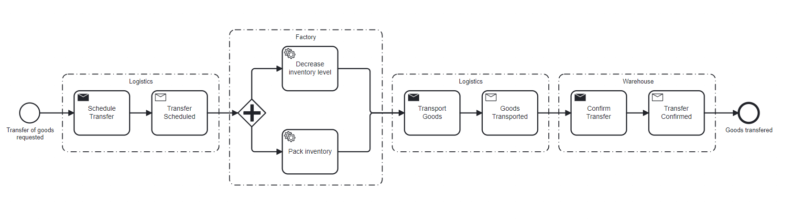
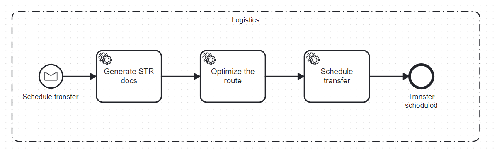
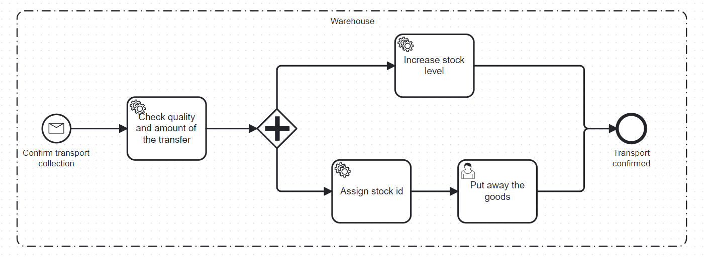
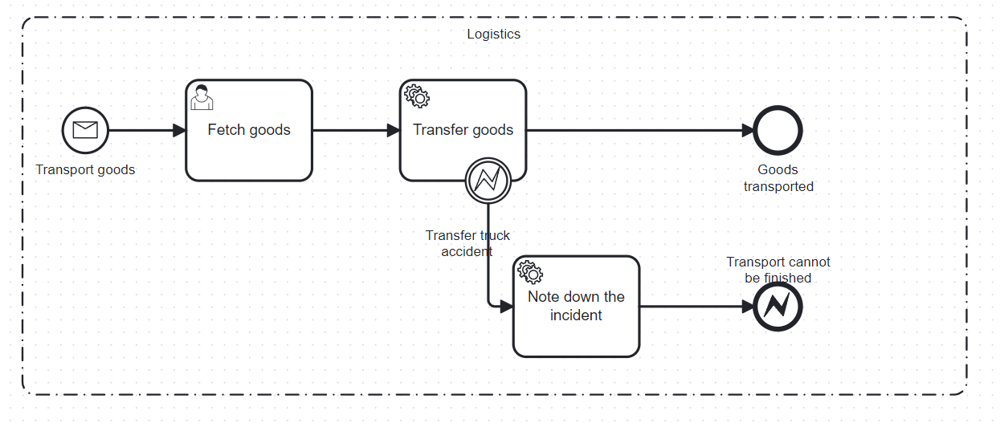

# Assignment 4: Orchestration versus Choreography
## Michal Cislo & Raffael Rot

### Table of Content

1. Instructions
2. BPMN process within the factory
3. BPMN process to transfer goods
4. Contribution

#### Instructions
1. Go to the path /project/.

2. Execute the command:
```
docker-compose up --build
```
3. Open the camunda platform http://localhost:3000
4. Log in with the credentials: `username=demo` && `password=demo`

#### BPMN process within the factory

Send a request to factory starting the "Start Production Line" process.
```
CURL -X POST http://localhost:3000/factory/start-production-line -d ""
````


The process starts with a [POST request](https://github.com/nikokelx/event-driven_and_process-oriented-architecture_group-5/blob/main/project/factory/src/main/java/ch/unisg/factory/controllers/http/StartProductionLineWebController.java). 
The client needs to fill out the form and be sure they want to initiate the process. 
In the meantime, the current status of the machine is queried in [StartProductionLineProcess](https://github.com/nikokelx/event-driven_and_process-oriented-architecture_group-5/blob/main/project/factory/src/main/java/ch/unisg/factory/core/services/StartProductionLineProcess.java) and saved into a variable in the camunda engine. 
Then, a check is performed at the 'exclusive gateway machine status' gate. If the machine is off, the service task [Toggle Machine Status](https://github.com/nikokelx/event-driven_and_process-oriented-architecture_group-5/blob/main/project/factory/src/main/java/ch/unisg/factory/core/services/ToggleMachineStatusProcess.java) is called. 
This sends a [command to the Machine microservice](https://github.com/nikokelx/event-driven_and_process-oriented-architecture_group-5/blob/main/project/factory/src/main/java/ch/unisg/factory/infrastructure/adapters/http/ToggleMachineStatusWebAdapter.java)
to activate it, which in turn emits an event. The Factory listens to this [topic](https://github.com/nikokelx/event-driven_and_process-oriented-architecture_group-5/blob/main/project/factory/src/main/java/ch/unisg/factory/controllers/event/MachineStatusEventListener.java). A timer for 15 seconds starts. 
After that, another [command](https://github.com/nikokelx/event-driven_and_process-oriented-architecture_group-5/blob/main/project/factory/src/main/java/ch/unisg/factory/infrastructure/adapters/http/ToggleMachineProductionWebAdapter.java) is sent to the machine, and it begins the production of wood shavings.
The process ends with the intention of starting the CiRa production line.

#### BPMN process to transfer goods

This process takes care of the transfer of goods request initiated in `Factory` microservice. This process implements distributed responsibilities to avoid **Process Monolith**.
While developing this process we tried to find a good balance between `Choreography` implementing events and `Orchestration` implementing commands.<br>
Since deciding on whether to use **Events** or **Commands** require answering the `Is it OK with the component emitting an event if that event is ignored?` question, we did it and ended up with the main process looking as follows:



And divisions to bounded contexts to distribute responsibilities and achieve a level of isolation:






So far we have not implemented all of the bounded contexts but the first step of scheduling the transfer (command and event) plus the process within the logistics service is complete.


#### Contribution

We are a team, we work as a team. 
