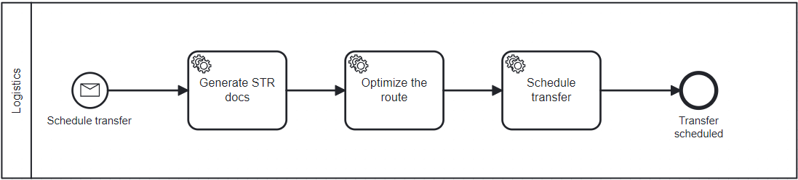
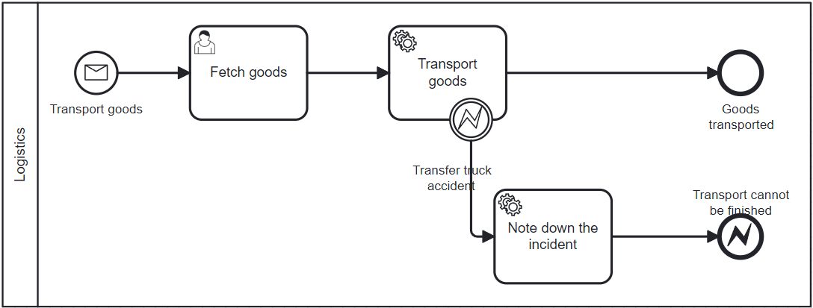

# Microservice Logistics

## Introduction

The Logistics part deals with transporting goods between different stages of production. It schedules
transfers, picks up goods from the factory, and delivers them to the warehouse. This microservice
plays a role in ensuring delivery of goods, optimizing supply chain efficiency.

## Features
**Scheduling Transfers** - The logistics microservice handles the scheduling of all goods transfers within the production and distribution network. This includes generating necessary documents and planning the optimal routes to minimize delays and maximize efficiency.

**Goods Pickup** - The microservice coordinates the pickup of goods directly from the factory. It ensures that products are collected on time and handled with care to maintain their quality during transportation.

**Delivery to Warehouse** - Once goods are picked up, the logistics microservice ensures their delivery to the designated warehouse. It monitors the entire delivery process to avoid any disruptions and ensure that the inventory levels at the warehouse are maintained as per the demand.

## Processes

1. Schedule Transfer Process:



2. Transport Goods Process:



## Selected code parts

Logistics microservice receives two commands from the main `transferGoodsComplete` process. Those commands are retrieved in `MessageListener`:
```java
@Component
public class MessageListener {

    @Autowired
    private CommandsHandler commandsHandler;

    @Transactional
    @KafkaListener(id = "logistics", topics = CiraMessageSender.TOPIC_NAME)
    public void messageReceived(String messagePayloadJson, @Header("type") String messageType) throws Exception {
        switch (messageType) {
            case "ScheduleTransferCommand" -> commandsHandler.ScheduleTransfer(messagePayloadJson);
            case "TransportGoodsCommand" -> commandsHandler.TransportGoods(messagePayloadJson);
            default -> {
                System.out.println("Ignoring message in Logistics ML of type " + messageType);
            }
        }
    }
}
```

And later correlated by `commandsHandler` to start the sub-processes `Schedule Transfer Process` and `Transport Goods Process`